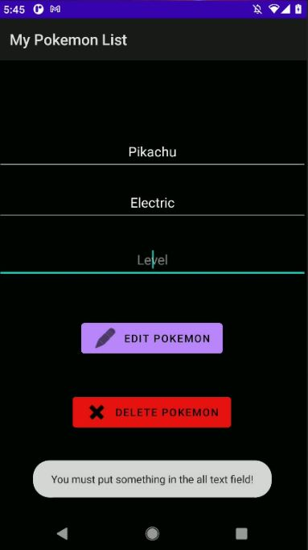

# PokeList App

Name: Armando Cardozo

Student Number:  C19739031
## 

This is an android app, that allows the users to keep a record of the different pokemon they encounter in their area on the PokemonGo game. It implement Lists, Databases and perfom all CRUD operations.

## Features

- Local database that store PokeStops and Pokemon nearby.
- The users can add, edit and delete a Pokemon from each PokeStop.

## Intructions 

-- Once you start the app, you'll be presenting with the home screen. 

-- Click on the "See nearby PokeStop" buttom to see a list of PokeStop nearby

-- Select a PokeStop form the list.

-- Here you can view a list of the Pokemon available (if any), and edit or delete them, or add a new one.

-- If you add a new Pokemon, make sure you complete all the fields, otherwise you'll get a warning. 

Home Page:

PokemonStops:

Pokemon Lists:

Edit Pokemon:

## History
 
Version 0.1 (2021-11-23) - adding basic Lists and local SQLite Database functionality.
 
 
## License
 
The MIT License (MIT)

Copyright (c) 2021 Armando Cardozo

Permission is hereby granted, free of charge, to any person obtaining a copy of this software and associated documentation files (the "Software"), to deal in the Software without restriction, including without limitation the rights to use, copy, modify, merge, publish, distribute, sublicense, and/or sell copies of the Software, and to permit persons to whom the Software is furnished to do so, subject to the following conditions:

The above copyright notice and this permission notice shall be included in all copies or substantial portions of the Software.

THE SOFTWARE IS PROVIDED "AS IS", WITHOUT WARRANTY OF ANY KIND, EXPRESS OR IMPLIED, INCLUDING BUT NOT LIMITED TO THE WARRANTIES OF MERCHANTABILITY, FITNESS FOR A PARTICULAR PURPOSE AND NONINFRINGEMENT. IN NO EVENT SHALL THE AUTHORS OR COPYRIGHT HOLDERS BE LIABLE FOR ANY CLAIM, DAMAGES OR OTHER LIABILITY, WHETHER IN AN ACTION OF CONTRACT, TORT OR OTHERWISE, ARISING FROM, OUT OF OR IN CONNECTION WITH THE SOFTWARE OR THE USE OR OTHER DEALINGS IN THE SOFTWARE.

